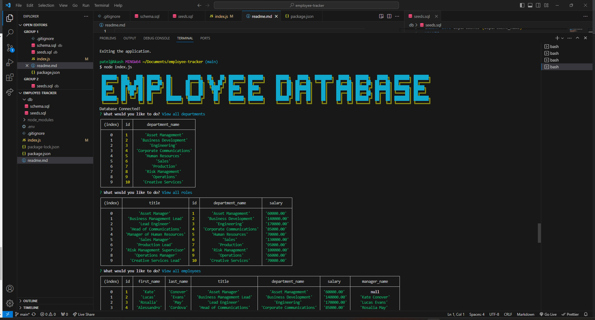

# Employee Tracker 

This command-line application is designed to help companies manage their employee database efficiently. It provides a user-friendly interface to perform various tasks related to departments, roles, and employees. With this application, you can:

- View all departments, roles, and employees.
- Add new departments, roles, and employees.
- Update an employee's role.
- View employees by manager.
- View employees by department.
- Delete departments, roles, or employees.
- View the total utilized budget of a department.

## Features

- Interactive command-line interface (CLI) powered by Inquirer.
- Integration with a MySQL database to store and manage employee data.
- CRUD (Create, Read, Update, Delete) operations for departments, roles, and employees.
- Easy navigation through the application using a menu system.

# Assitence From:
* Thomas Calle youtube
* Bobbi Tarkany tutor
* w3 schools

# Links
* https://github.com/akash301994/employee-tracker 
* https://drive.google.com/file/d/1QvF3XkhdAjioctyj8Fh84jrqnHO-xQVG/view
